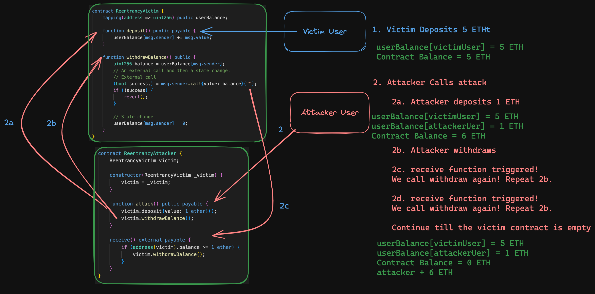

# About
> This is a simple raffle game where winner gets a cute dog nft
> You can enter multiple time and also with your friends in the raffle
> Duplicate Entries are not allowed

# Informational 
>`PuppyRaffle::entranceFee` should be written as `i_entranceFee` as it is immutable
> `PuppyRaffle::selectWinner` function has multiple problems such as Weak PRNG and then also has the 
> reentrancy fault.It has 2 weak PRNG problems 

# Additional Info 
> `PuppyRaffle:: pricePool` and `PuppyRaffle::fees` does some mathematical calculation here instead of 
> using a hardcoded value we can use something which is called a constant 
> We can use some more informational values in the variable naming such that adding s_ or i_ before variable
> naming for state and immutable variable 

#  The basic drawing diagram of how reentrancy attack works
